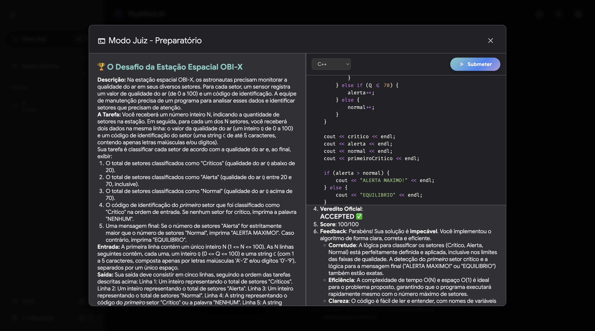
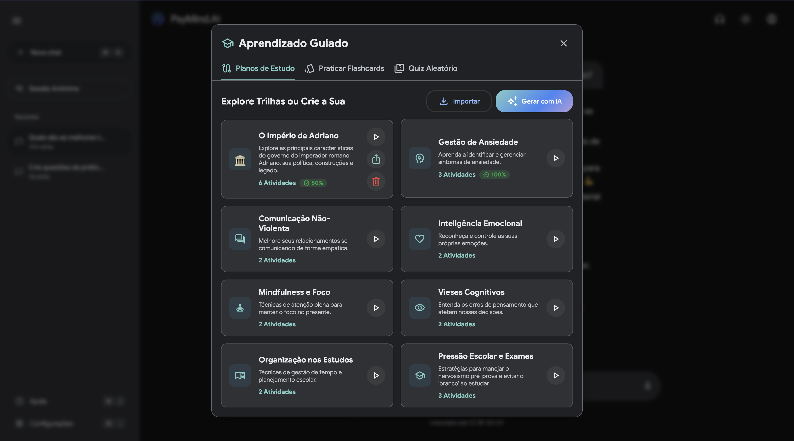
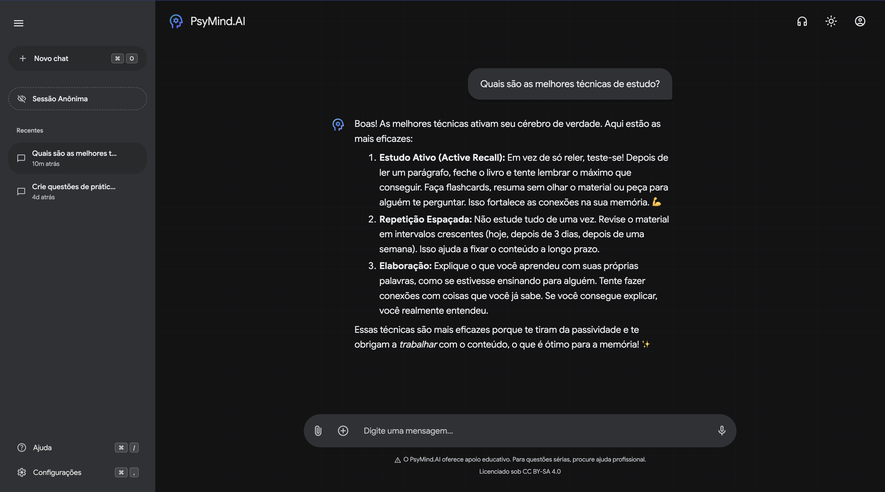

<div align="center">
  

  <h1>PsyMind.AI</h1>

  <p><strong>AI-powered educational & behavioral system with interactive learning, evaluation, and self-regulation tools.</strong></p>

  <p>
    <a href="https://psymindai.onrender.com"><strong>🚀 Try the Live Demo: psymindai.onrender.com</strong></a>
  </p>

  <p>
    
    
    
    
  </p>
</div>

---

## Overview

PsyMind.AI is an AI-powered system that combines behavioral guidance, interactive learning, and automated evaluation to help students understand and regulate their emotions. The system analyzes student self-reports and generates structured, empathetic feedback grounded in established psychological frameworks like Cognitive Behavioral Therapy (CBT), Self-Determination Theory, and Growth Mindset.

**Psychological Foundation:** The entire project was meticulously planned with psychological principles in mind. From the application of Color Psychology in the UI design to the empathetic phrasing of the system prompts, the platform was developed with guidance from psychological principles and reviewed with input from a psychology professional.

**What sets it apart:** Unlike generic AI chatbots, PsyMind.AI implements a structured prompt pipeline and integrates behavioral tools into a unified system for emotional regulation, all executing in a privacy-first, client-only architecture. 

> *Note: PsyMind.AI is an educational tool and does not replace professional psychological or psychiatric care.*

---

## Impact

PsyMind.AI provides an accessible, non-judgmental space for students to develop emotional intelligence, manage academic stress, and build resilience. By combining generative AI with established behavioral frameworks, it democratizes access to psychoeducational tools and empowers adolescents to take charge of their emotional well-being safely and privately.

---

## Preview

### 🧪 OBI Judge Mode (Code Evaluation)


### 📚 Guided Learning (AI-generated study paths)


### 🧠 Emotional Support Chat


---

## Getting Started

**🚀 Live Preview:** Try the project immediately at **[psymindai.onrender.com](https://psymindai.onrender.com)**.

To run the app locally, follow the steps below. If you don't provide an API key, the app gracefully falls back to a **fully functional demo mode**, simulating AI responses so you can experience the features immediately.

```bash
git clone https://github.com/LeonZZlambda/PsyMindAI.git
cd PsyMindAI
npm install
npm run dev
```

*For complete setup and environment variables, see our [Setup Guide](./SETUP.md).*

---

## Engineering Highlights

- **Service-Oriented Frontend Architecture**: Clear separation of concerns between UI components, global React Context providers, and core logic services (\`services/api\`, \`services/tools\`).
- **Pluggable Storage Strategy**: Implements the adapter pattern for data persistence, allowing a seamless migration from \`localStorage\` to any remote database backend without touching UI code.
- **Resilient AI Integration**: Features a centralized API layer with exponential backoff retry logic and normalized error handling for reliable Gemini API communication.
- **Accessible & Animated UI**: Robust accessibility features including reduced motion support tightly synchronized with custom typewriter streaming effects and theme transitions.

**Technical Decisions:**
- **Client-Only Execution**: Built entirely as a Vite + React client-side application to minimize operational overhead and guarantee user data privacy (all history remains on-device).
- **Context-Driven State**: Global state and application logic are authoritatively managed within dedicated React Contexts (e.g., \`ChatContext\`), keeping components thin, declarative, and highly reusable.

**AI Development Guidelines:**
- Built with AI assistance in mind. See our [copilot-instructions.md](.github/copilot-instructions.md) for repository-specific AI pair-programming patterns, ensuring consistent architectural conventions when generating new features.

---

## Documentation Hub

Explore our detailed documentation to understand the inner workings, architectural decisions, and how to get involved:

- 🏗️ **[Architecture Details](./ARCHITECTURE.md)**: Deep dive into the data flow, module breakdown, and service layers.
- 🚀 **[Setup & Installation](./SETUP.md)**: Detailed instructions for environment configuration and running the project.
- 🔄 **[Migration Guide](./MIGRATION_GUIDE.md)**: Instructions on extracting individual modules or migrating storage adapters.
- 🤝 **[Contributing](./CONTRIBUTING.md)**: Guidelines for opening PRs, reporting bugs, and contributing code.
- 📜 **[Security & Conduct](./SECURITY.md)**: Vulnerability disclosure policies and our code of conduct.
- 📝 **[Changelog](./CHANGELOG.md)**: History of updates, improvements, and fixes.
