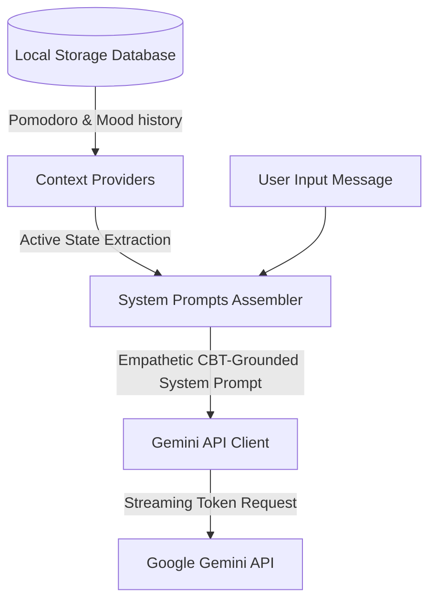
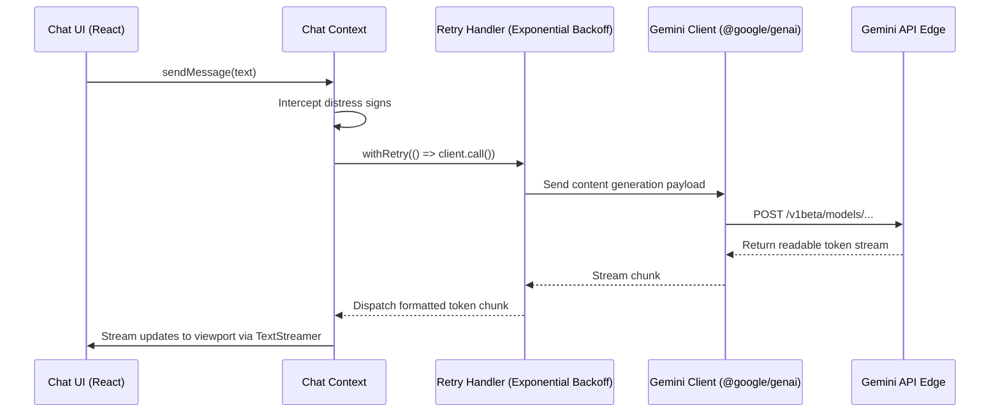
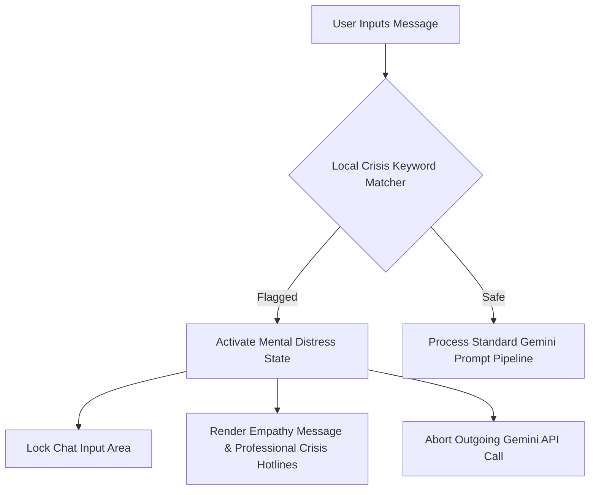
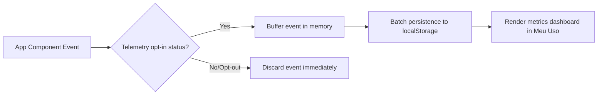

<div align="center">
  

  <h1>PsyMind.AI</h1>

  <p><strong>A privacy-first, edge-only AI psychoeducational system and self-regulation platform built for students.</strong></p>

  <p>
    <a href="https://psymindai.onrender.com"><strong>🚀 Try the Live Demo: psymindai.onrender.com</strong></a>
  </p>

  <p>
    
    
    
    
    
    
  </p>
</div>

---

## 📖 What It Is

**PsyMind.AI** is an advanced psychoeducational system that integrates behavioral self-regulation tools, automated skill evaluations, and AI-guided study paths. Grounded in Cognitive Behavioral Therapy (CBT), Self-Determination Theory, and color psychology, it provides a safe, on-device environment for adolescents to manage academic stress and emotional well-being.

## ⚡ Why It Is Technically Interesting

- **Client-Side prompt assembly:** Injects active local metrics (mood logs, Pomodoro focus blocks) into the LLM system context entirely on the edge, avoiding backend request hops and protecting data privacy.
- **Active clinical guardrails:** Automatically detects mental distress signals locally and locks the AI layer, instantly routing the user to hotlines and professional networks.
- **Enterprise-Grade Testing & Observability:** Hardened with E2E Playwright tests, AI behavior regression tracking via Promptfoo, and built-in hooks for Sentry (Error Tracking), Posthog (Product Analytics), and Langfuse (LLM Observability).
- **Lighthouse 95+ PWA & Edge Routing:** Relies on advanced Workbox strategies combining `StaleWhileRevalidate`, precaching, vendor bundle splitting (`rollup-plugin-visualizer`), and graceful offline SPA fallbacks.
- **Custom Spaced Repetition (SRS) Engine:** Dynamically calculates memory decay and user proficiencies to adjust study card queues on the fly.
- **Privacy-First telemetry:** Telemetry logging runs completely on the device with local analytical dashboards, requiring explicit user consent before storing opt-in metrics in local databases.

---

## 🚀 60-Second Quickstart

```bash
# Clone the repository
git clone https://github.com/LeonZZlambda/PsyMindAI.git && cd PsyMindAI

# Install dependencies, duplicate the environment template, and run
npm install && cp .env.example .env && npm run dev
```

_Note: If no Gemini API Key is configured in `.env`, the system automatically activates a **zero-cost mock/demo mode** with simulated streaming logic for instant local evaluation._

### 🛠️ Working with Enterprise Tools

```bash
# Run Unit & Integration Tests (Vitest)
npm run test

# Run AI Behavior / Prompt Regression tests (Promptfoo)
npm run test:prompts

# Run UI E2E Tests (Playwright)
npm run test:e2e
npm run test:e2e:ui # Interactive visual mode

# Visualize bundle sizes & heavy dependencies
npm run analyze:ui
```

---

## 🎨 System Design Highlights

### 1. Context-Injection Prompt Assembly

Augments LLM prompt parameters dynamically in the browser using local behavior metrics.



### 2. Client-Side AI Request & Response Lifecycle

Maintains smooth, resilient, and non-blocking streaming transitions.



### 3. Safety Guardrails & Distress Rerouting

Monitors user messages in real-time, locking out AI interactions upon detecting crisis-related vocabulary.



### 4. Telemetry Opt-in & On-Device Analysis

Logs usage metrics securely with full compliance, processing and visualising data locally.



---

## ✨ Premium Features

### 🧪 OBI Judge Mode (Interactive Code Evaluation)

Enables students to write, execute, and evaluate algorithms locally. Provides real-time execution outputs, logic debugging tools, and modular testing panels.


### 📚 Guided Learning (AI Study Paths)

Generates personalized study structures and custom flashcards tailored to individual learning styles. Evaluates student proficiencies using active recall diagnostics.


### 🧠 Emotional Support & Self-Regulation Chat

An AI companion that listens, structures thoughts, and recommends cognitive restructuring techniques.


---

## 🛠️ Engineering & Optimization Decisions

### 🏗️ Architectural Foundations

- **Why client-side AI?** Eliminates server runtime overhead, simplifies deployment, and guarantees that user chat data never touches middle-tier databases.
- **Why Vite over Next.js?** Allows compiling the application into a standard static single-page app (SPA), making it trivial to host on serverless CDNs (GitHub Pages, Render) and enable offline-ready progressive web app (PWA) behaviors.
- **Why Gemini 1.5 Flash?** Outperforms models in its class with ultra-low latency, native streaming support, and structured JSON responses required for matching user states to specific UI layouts.
- **Why local-first telemetry?** Offers GDPR-by-design. Users maintain absolute ownership of their analytics; data is never transmitted to tracking servers.

### ⚡ Performance Optimization

- **Vite manual chunk splitting:** Configured custom bundles separating core vendors, `framer-motion`, `zod`, `markdown-vendor`, and `genai-vendor` to keep the main bundle thin and interactive under 2s on mobile connections.
- **Lazy-loaded modals:** Dynamically loads large modular panels (e.g. `GuidedLearningModal`, `VocationalTestModal`) via `React.lazy` only when requested.
- **Skeleton-first layouts:** Reduces perceived latency using skeleton cards during asynchronous content streams.
- **Active tree-shaking:** Implemented `"sideEffects": ["*.css"]` in `package.json` to enable optimal asset tree-shaking by the bundler.

### 🛡️ Security & Privacy

- **Client-only boundaries:** API keys are injected at build time (Vite env) or dynamically loaded from user settings, stored securely on their local device storage.
- **No remote synchronization:** Chat database updates, settings, and behavioral logs reside strictly in the client's local database.

---

## 🧪 Verification & Testing

Our test suite verifies components, logic, and state adapters using **Vitest**.

```bash
# Run the test suite
npm run test

# Run tests with HTML coverage report
npm run test:ci

# Start production build & preview locally
npm run build && npm run preview
```

---

## 📂 Documentation Hub

Explore detailed documentations:

- 🏗️ **[Architecture Details](./ARCHITECTURE.md)**: Class definitions, module boundaries, and sequence schemas.
- 🚀 **[Setup & Installation](./SETUP.md)**: Node versions, custom keys, and environment instructions.
- 🔄 **[Migration Guide](./MIGRATION_GUIDE.md)**: How to extract these tools or switch database adapters.
- 🤝 **[Contributing](./CONTRIBUTING.md)**: Standards for adding features, testing, and writing translations.
- 📜 **[Security & Conduct](./SECURITY.md)**: Security report policies and Code of Conduct.

---

## ⚖️ License & Attributions

Distributed under the **MIT License**. See `LICENSE` for details.

_Academic note: PsyMind.AI was planned with psychological guidelines, incorporating color psychology and empathetic frameworks (CBT/Self-Determination). The project's flows and prompts were reviewed with feedback from licensed psychology professionals._
